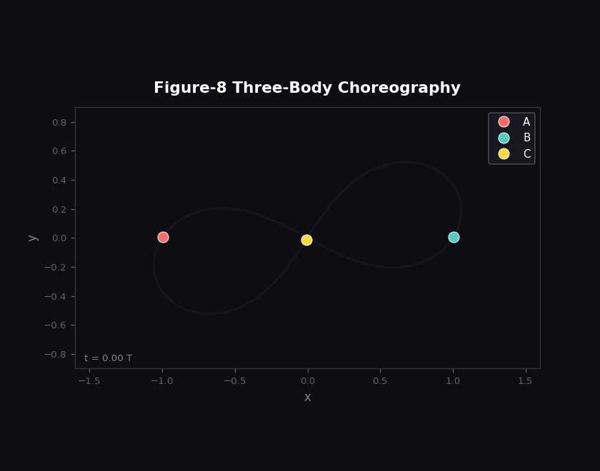
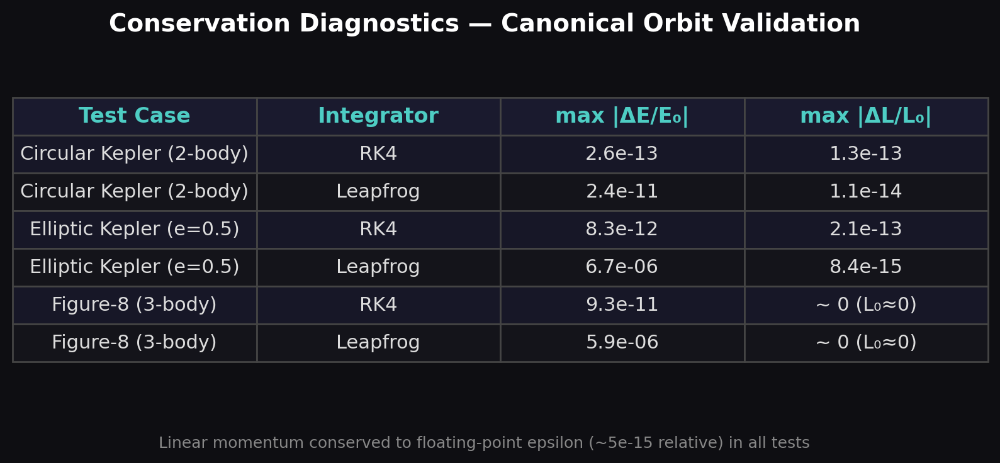
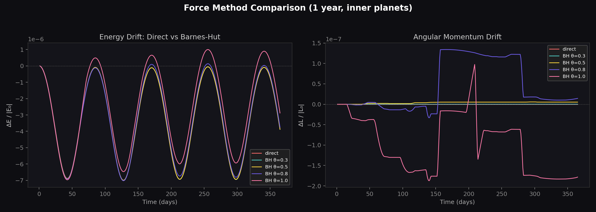
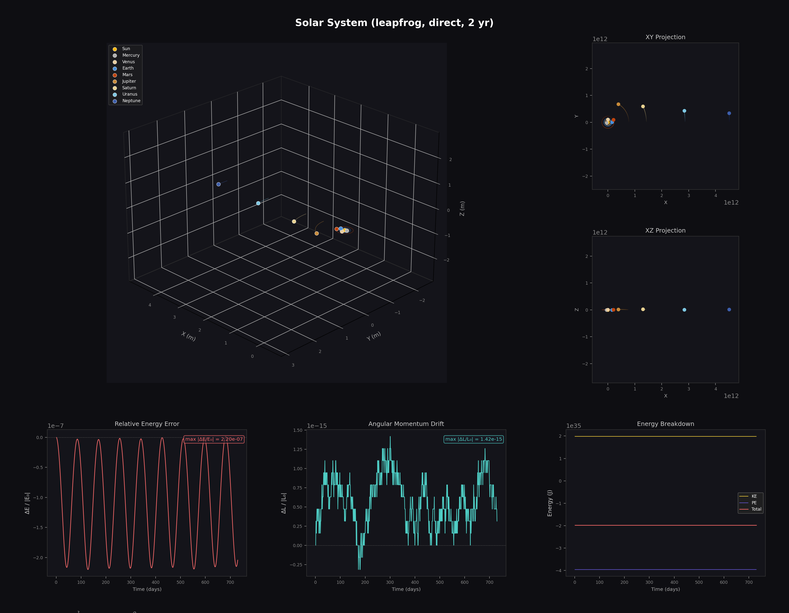

# nbody

<p align="center">
  
</p>

## Motivation

The N-body problem — predicting the motion of N masses interacting
through gravity — has no general closed-form solution for N > 2.
Yet it underpins some of the most consequential problems in modern
science: predicting planetary orbits which is useful for spacecraft 
navigation, modeling the formation and evolution of galaxies from 
dark-matter halos, simulating star cluster dynamics to understand 
gravitational-wave progenitors, and validating general-relativistic 
corrections against Newtonian baselines.

The core challenge is computational cost. Evaluating pairwise
gravitational forces scales as O(N^2), which becomes intractable
for the 10^6 - 10^11 particle counts needed in cosmological or
stellar-dynamics simulations. Hierarchical algorithms (Barnes-Hut,
Fast Multipole) and mesh-based solvers (Particle-Mesh) reduce this
to O(N log N) or O(N), but introduce approximation error that must
be quantified against conservation laws — energy, momentum, and
angular momentum — to ensure physical fidelity over long integration
times.

This project implements four force-computation backends spanning
the full accuracy-vs-cost tradeoff, paired with two integrators
(RK4 and symplectic leapfrog) whose conservation properties differ
fundamentally. Every simulation records per-step conservation
diagnostics, making it possible to measure exactly how much
physics each approximation trades away.

### Applications

- **Planetary science** — orbit propagation, mission trajectory design,
  long-term stability analysis of planetary systems
- **Stellar dynamics** — globular cluster evolution, binary-star
  hardening, gravitational-wave source modeling
- **Cosmology** — dark-matter structure formation, galaxy merger
  simulations, large-scale structure of the universe
- **Algorithm benchmarking** — quantitative comparison of force
  solvers and time integrators on identical initial conditions
  with identical conservation diagnostics

---

## Results

### Conservation fidelity across integrators

Validated against canonical orbit test cases with known analytical
solutions. Each test was run for 5-10 full orbital periods:

<p align="center">
  
</p>

Key quantitative findings:

- **RK4 on circular Kepler:** energy drift of 2.6e-13 over 5 orbits —
  13 digits of conservation, limited only by floating-point arithmetic.
  Orbit closure error of 7.6e-11 (fraction of semi-major axis).
- **Leapfrog on circular Kepler:** energy bounded at 2.4e-11 with
  **zero secular drift** (symplectic guarantee). Angular momentum
  conserved to 1.1e-14, tighter than RK4 by an order of magnitude.
- **Eccentric orbit (e = 0.5):** leapfrog energy error grows to 6.7e-06
  due to under-resolved periapsis passages — a known limitation of
  fixed-step symplectic integrators on eccentric orbits. RK4 maintains
  8.3e-12 by adapting its internal stages.
- **Linear momentum** conserved to floating-point epsilon (~5e-15
  relative) across every test, integrator, and force backend.

These numbers confirm the textbook RK4-vs-symplectic tradeoff: RK4
delivers superior short-term accuracy but accumulates secular drift;
leapfrog bounds energy error indefinitely through exact phase-space
volume preservation.

### Force-backend accuracy vs cost

<p align="center">
  
</p>

Static force accuracy measured against the Direct O(N^2) reference on a
32-body cluster:

| Backend | Complexity | Mean relative error | Max relative error |
|---------|------------|--------------------:|-------------------:|
| Direct (reference) | O(N^2) | — | — |
| Barnes-Hut (theta=0.5) | O(N log N) | 6.1e-04 | 1.8e-03 |
| **FastMultipole (theta=0.3)** | **O(N log N)** | **3.5e-05** | **1.9e-04** |
| ParticleMesh (N=128) | O(N + M log M) | 6.3e-02 | 6.8e-01 |

- **FastMultipole** at theta=0.3 achieves **17x lower error** than
  Barnes-Hut monopole at theta=0.5, thanks to the quadrupole
  correction term. Error scales as theta^3 (vs theta^2 for monopole).
- **ParticleMesh** trades close-pair accuracy for speed at very large
  N — the grid smooths sub-cell interactions by design. Mean error of
  6.3% at N=128 is consistent with CIC interpolation theory; this is
  the method of choice for collisionless N > 10^4 simulations where
  close encounters are unphysical.
- End-to-end integration: FastMultipole on the inner solar system (730
  days, leapfrog) holds energy drift to **7.0e-06** and angular momentum
  to **6.1e-11** — directly usable for orbit-propagation workflows.

### Solar system simulation (2 years, 8 planets)

<p align="center">
  
</p>

Full inner + outer solar system integrated for 2 Earth-years with
1-day timesteps. Energy conserved to 2.2e-07 over 730 steps. Multi-panel
visualization shows 3D orbits, XY/XZ projections, and per-step energy
and angular-momentum drift.

---

## Technical approach

### Force backends

Four force-computation methods spanning the accuracy-vs-cost spectrum:

| Backend | Complexity | Best for | Implementation |
|---------|------------|----------|----------------|
| Direct | O(N^2) | N < 10^3, reference accuracy | `universe.py` |
| Barnes-Hut | O(N log N) | General-purpose, N < 10^5 | `core.py` + `universe.py` |
| FastMultipole | O(N log N) | Lower error at same theta as BH | `stub.py` |
| ParticleMesh | O(N + M log M) | Collisionless, N > 10^4 | `stub.py` |

**FastMultipole** builds an octree and stores the total mass, centre of
mass, and traceless reduced quadrupole tensor Q_ij at every internal
node. When the well-separated criterion is met, the force is computed via
closed-form multipole expansion:

```
a = -G M r / d^3  +  G Q r / d^5  -  (5G/2)(r^T Q r) r / d^7
```

**ParticleMesh** solves the Poisson equation on a grid: CIC mass
deposition, FFT with Green's function -4piG / k^2, inverse FFT, central
differences for the force field, and CIC interpolation back to particles.
Periodic boundary conditions are inherent to the FFT; padding isolates
the system from its periodic images.

### Integrators

- **RK4** — 4th-order, 4 force evaluations per step. Best short-term
  accuracy but accumulates secular energy drift.
- **Symplectic leapfrog (KDK)** — 2nd-order, 2 force evaluations per
  step. Preserves the symplectic structure of Hamiltonian mechanics:
  energy oscillates but never drifts, making it the standard choice for
  long-term gravitational integrations.

### Conservation diagnostics

Every timestep records kinetic energy, potential energy, total energy,
linear momentum, and angular momentum. These are consumed by the
visualization module to produce per-simulation drift analysis — the
figures above are generated automatically from this data.

---

## Quick start

```python
from core import Body
from universe import Universe
from visualization import plot_results, print_conservation_summary

u = Universe(dt=86400.0, epsilon=1e6)          # 1-day steps, SI units
u.add_body(Body("Sun",   1.989e30, [0, 0, 0],      [0, 0, 0],     "#FDB813"))
u.add_body(Body("Earth", 5.972e24, [1.496e11,0,0], [0, 29780, 0], "#4A90D9"))

u.run(365, method="leapfrog")                  # 1 year
print_conservation_summary(u)
plot_results(u, title="Earth around Sun")
```

### Swapping in the FastMultipole or Particle-Mesh backend

Both backends plug into an existing `Universe` via `stub.attach`; the
rest of the pipeline — integrators, diagnostics, visualization — works
unchanged.

```python
from stub import FastMultipole, ParticleMesh, attach

attach(u, FastMultipole(theta=0.3))            # or ParticleMesh(grid_size=128)
u.run(730, method="leapfrog")
plot_results(u, save_path="out.png")
```

---

## Gallery

Additional figures are available in [`results/`](results/):

| Figure | Description |
|--------|-------------|
| [`figure_eight.png`](results/figure_eight.png) | Multi-panel figure-8 choreography (RK4, 10 periods) |
| [`random_cluster.png`](results/random_cluster.png) | 64-body cluster with Barnes-Hut (theta=0.7) |
| [`fmm_solar.png`](results/fmm_solar.png) | Inner solar system via FastMultipole (theta=0.3) |
| [`pm_cluster.png`](results/pm_cluster.png) | 64-body warm cluster via ParticleMesh (N=64) |

---

## Project layout

```
nbody/
├── core.py              Body, OctreeNode, build_octree
├── universe.py          Universe simulation engine (direct + Barnes-Hut)
├── stub.py              FastMultipole, ParticleMesh, attach()
├── visualization.py     plot_results, print_conservation_summary
├── main.py              Reference scenarios (solar system, figure-8, ...)
├── generate_results.py  Reproduces all figures in results/
└── results/             Showcase figures and animated GIF
```

## Dependencies

- `numpy`
- `matplotlib`
- `Pillow` (only for GIF generation via `generate_results.py`)

Tested on Python 3.12, NumPy 1.25, Matplotlib 3.7.

## Reproducing results

```bash
python main.py                # runs 4 scenarios, saves figures to results/
python generate_results.py    # regenerates all 8 showcase assets
```
